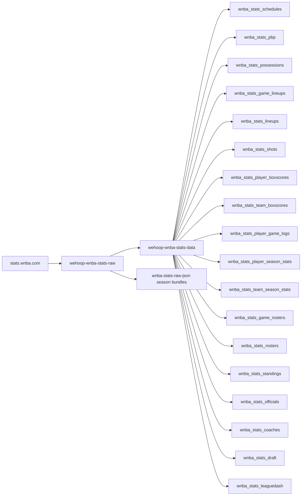
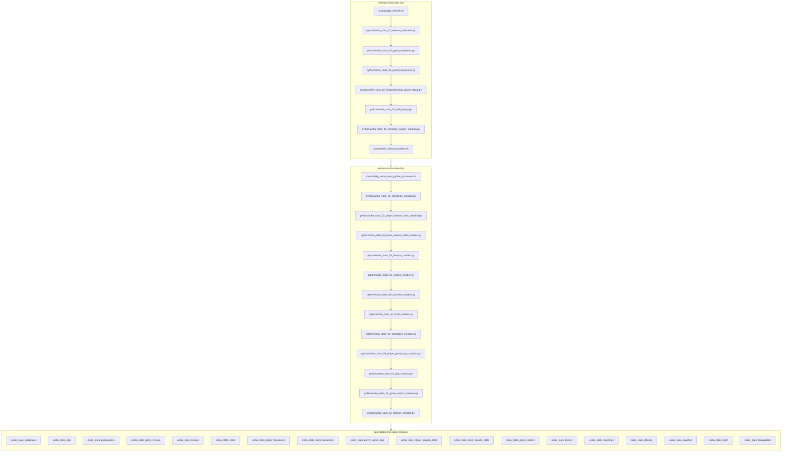

# wehoop-wnba-stats-raw

Raw cache of WNBA Stats API (`stats.wnba.com`) payloads. Scrapers live in
`python/`, bash entry points in `scripts/`, and captures land under
`wnba_stats/json/{endpoint}/{season}/{variant|game_id}.json` (league-level
endpoints write a flat `{endpoint}/{season}.json`). Downstream:
`wehoop-wnba-data` builds tidy datasets from this store.

**The season in a path is a claim about the payload, not just a filename.**
`{endpoint}/2013.json` holds the payload the API returned *filtered to 2013* —
verified for `drafthistory` on 2026-08-12, where the 30 per-season files are
mutually distinct and each echoes its own `"Season"`. It was briefly untrue:
`_SEASON_PARAMS` matched season parameters by exact name and `drafthistory`
alone spells its season `season_year_nullable`, so the filter was dropped and
the sweep wrote the same full-history payload under all 30 seasons (sdv-py
b17685a6). An unfiltered call that answers with *everything* rather than
nothing is the quiet failure to watch for when adding an endpoint: check that
two seasons differ, not just that the file is non-empty.

Each script's header comment is the authoritative doc — read it before
running. This section is the map, not the manual.

## wehoop WNBA Stats workflow diagram

`scripts/daily_refresh.sh` (raw) and `scripts/daily_wnba_stats_python_processor.sh`
(data) are the drivers; the raw side also publishes whole-season JSON bundles to
its own `wnba-stats-raw-json` release. Stage numbers are intended build order,
not run order.

[wehoop-wbb-raw repository (source: ESPN)](https://github.com/sportsdataverse/wehoop-wbb-raw)

[wehoop-wbb-data repository (source: ESPN)](https://github.com/sportsdataverse/wehoop-wbb-data)

[wehoop-wnba-raw repository (source: ESPN)](https://github.com/sportsdataverse/wehoop-wnba-raw)

[wehoop-wnba-data repository (source: ESPN)](https://github.com/sportsdataverse/wehoop-wnba-data)

[wehoop-wnba-stats-raw repository (source: WNBA Stats)](https://github.com/sportsdataverse/wehoop-wnba-stats-raw)

[wehoop-wnba-stats-data repository (source: WNBA Stats)](https://github.com/sportsdataverse/wehoop-wnba-stats-data)

[ncaa-wbb-hoops-raw repository (source: stats.ncaa.org)](https://github.com/sportsdataverse/ncaa-wbb-hoops-raw)

[ncaa-wbb-hoops-data repository (source: stats.ncaa.org)](https://github.com/sportsdataverse/ncaa-wbb-hoops-data)

## Run order

1. **Cold backfill** (rare, multi-hour): `bash scripts/backfill.sh 1997:2026`
   — or, for unattended runs, wrap the sweep in the crash-restart supervisor:
   `tmux new-session -d -s sweepsup 'bash ops/supervise_sweep.sh 1997:2026'`.
   Run `bash ops/commit_loop.sh <launcher_pid>` alongside so multi-hour
   captures are committed per season as they finish, not lost on a crash.
2. **Daily** (cron): `bash scripts/daily_refresh.sh` — current-season top-up,
   then commit+push.
3. **Repair** (as needed): `bash ops/refill_empty_payloads.sh --check`
   to census empty `{}` payloads, then run without `--check` from a
   residential IP to refetch them.
4. **Publish** (after a backfill or season close): `bash
   ops/publish_season_bundles.sh` — a real pipeline stage, not optional:
   `wehoop-wnba-stats-data`'s full rebuilds consume its per-season tarballs
   instead of ~100k per-file GETs.

All scrapes need a residential IP or the proxy pool — stats.wnba.com hangs
(does not error) on datacenter IPs.

## Ops scripts

| Script | What / when | Watch |
|---|---|---|
| `scripts/backfill.sh [A:B]` | Full resumable backfill driver (skips on-disk payloads; refuses to run un-proxied). Manual, rare. | `tail -f logs/backfill.log` |
| `ops/supervise_sweep.sh [A:B]` | Crash-restart wrapper around `python/_capture_runtime.py`: relaunches on abnormal death, stops on "sweep complete", gives up after `MAX_RESTARTS`. Launch under tmux/nohup. | `tail -f logs/watchdog_*.log` |
| `ops/commit_loop.sh <pid>` | Commits the store per-season on a timer while a sweep runs, exits when the watched pid dies. Pass the pid — `pgrep` fallback is blind under Git Bash. | `git log --oneline` |
| `ops/commit_raw_json.sh` | Per-season commit+push of captured JSON (both store shapes). Idempotent; the "(Start: YYYY End: YYYY)" subject is parsed downstream. | `git log --oneline` |
| `scripts/daily_refresh.sh` | Cron entry point: sweep the current season, commit+push. Near-no-op in the offseason. | `tail -f logs/daily_refresh_*.log` |
| `ops/publish_season_bundles.sh [A:B]` | Builds one tarball per season under `.bundles/` and uploads to the `wnba-stats-raw-json` release. `DRY_RUN=1` to build without uploading; needs authed `gh`. | script stdout |
| `ops/refill_empty_payloads.sh` + `python/wnba_stats_20_refill_empty.py` | Repair pair for `{}` payloads persisted before the empty-payload guard: shell wrapper handles env/proxy/log, the python module deletes files `<= 2` bytes and refetches exactly those tuples. `--check` = census only, no network. | `tail -f logs/wnba_stats_20_refill_empty.log` |
| `python/wnba_stats_10_leaguegamelog_player_topup.py` | One-off top-up of the player-variant leaguegamelog (`*_p.json`); see its docstring for env caveats. | script stdout |
| `scripts/_venv.sh` | Sourced by every driver: resolves `SDV_PY` to the repo `.venv` (override with `WNBA_VENV_PYTHON`). Not run directly. | — |

## Env knobs

Rate/behavior tuning is env-only — never hardcoded — so a throttled run can
be re-paced without code edits:

- `SCRAPE_WORKERS` — sweep parallelism (backfill default 6, daily 4).
- `SDV_PY_NBA_STATS_TIMEOUT` — per-request timeout seconds (drivers default 90).
- `WNBA_VENV_PYTHON` — interpreter override, beats `.venv` (see `scripts/_venv.sh`).
- `PROXY_ENDPOINT` / `PROXY_KEY` / `PROXY_PKG` — proxy pool; live in
  `~/.Renviron`, which the drivers export (Python does not read `.Renviron`).
- `MAX_RESTARTS`, `INTERVAL`, `DRY_RUN`, `BUNDLE_TAG`, `BUNDLE_OUT_DIR` —
  per-script knobs; see the respective headers.

## Reports & explainers

<!-- BEGIN GENERATED: reports -->

| Report | What it is | Last updated |
|---|---|---|
| _none yet_ | — | — |

<!-- END GENERATED: reports -->

## Automation & status

<!-- BEGIN GENERATED: status -->

| workflow | schedule | last run |
|---|---|---|
|  | on push / dispatch | 2026-08-27 |
|  | on push / PR / dispatch | 2026-08-27 |

<!-- END GENERATED: status -->
